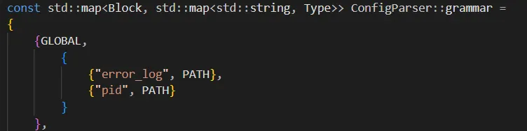
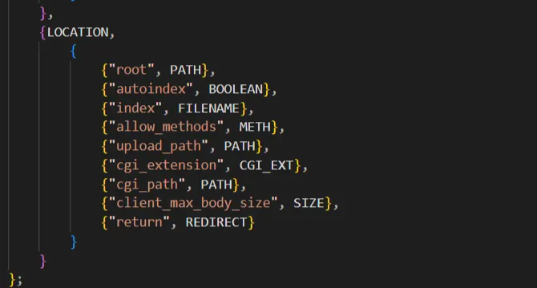
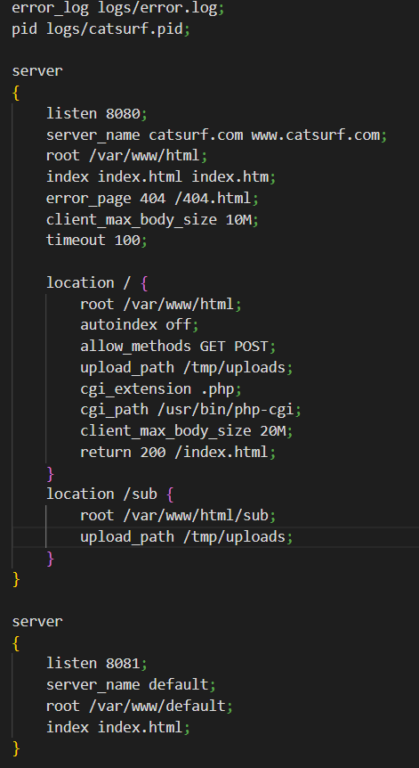

# Config File Grammar

I Global Block Optional

| error_log optional | path to file where server events & errors are logged | + debugging |
| --- | --- | --- |
| pid optional | path to file server proccess id | + managing server |

II Server Blocks 

| listen | port (+IP) where server listens for connections |
| --- | --- |
| root defaults | Base directory for serving files
Maps URLs to filesystem paths |
| index defaults | Default file to serve when the requested resource is a directory |
| server_name optional (defaults) | domain names server block responds to
serve different sites on same port (virtual host) |
| error_page defaults | default error pages |
| client_max_body_size defaults | sets maximum allowed size for client request bodies |
| timeout defaults | request timeout (request to server should never hang indefinitely) |
| location | block inside server block
defines config for specific URL paths 
”specify rules or conf on a URL/route”
different behaviour for different paths |

III Location Block

| root defaults to server root | overrides server root for this location |
| --- | --- |
| autoindex defaults | enable/disable directory listing |
| index defaults to server index |  |
| allow methods defaults | HTTP methods allowed for this location |
| upload_path empty | specifies where uploaded files should be saved
uploading files from client to server |
| cgi_extension empty | file extensions that should be executed as CGI scripts
determines which files need to be executed vs served statically |
| cgi_path empty | server should support at least one CGI
path to CGI interpreter executable |
| client_max_body_size
defaults to server c_m_b_s | eg. allow larger uploads on /upload route |
| return empty | HTTP redirection (eg 301,302) |

EXAMPLE CONFIG FILE

