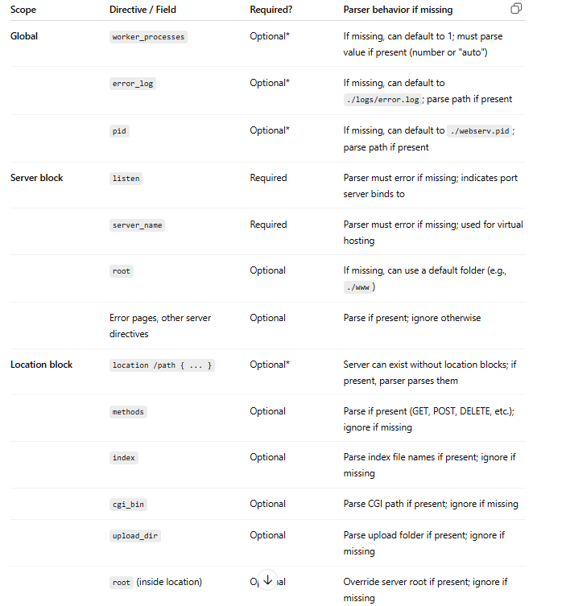

# Config File & Parsing

Global: defaults if missing / if empty: error
user surfing_cat;
worker_processes auto;
error_log: ./logs/error.log;
pid: ./catsurf.pid;
creates files and sets worker_processes on runtime

Server block: inside server block, must have: listen & server_name

location: inside the server block, optional

→ global must either be missing or before server, location must be inside server

AST Structure: